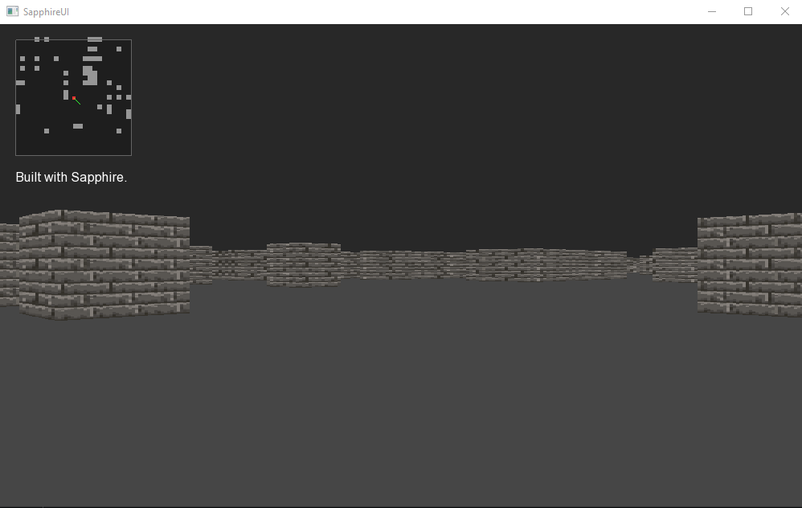

# SapphireRaycaster
A raycaster demo built using Sapphire 1.0.7 new module: Vector2D.


## How to run it?

  Pretty much just download the repo to your computer and run: ```sapphire Raycaster.sp``` . But make sure you're in the same directory as those two are. 

## What is in the game?

  A 64x64 labyrinth (kinda, I tried to tweak some of the generation but couldn't make it better than it is now) where you can: explore (yeah that's the only thing, but it's still pretty cool as a demonstration of what Sapphire can do!)

## Screenshots


